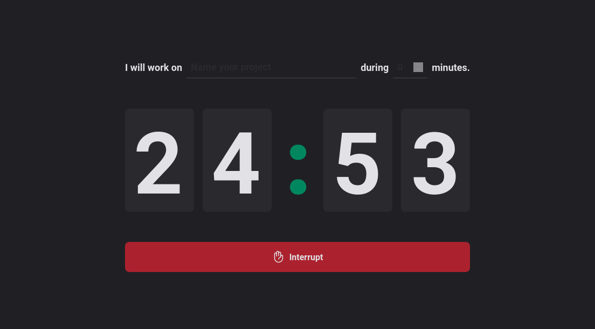
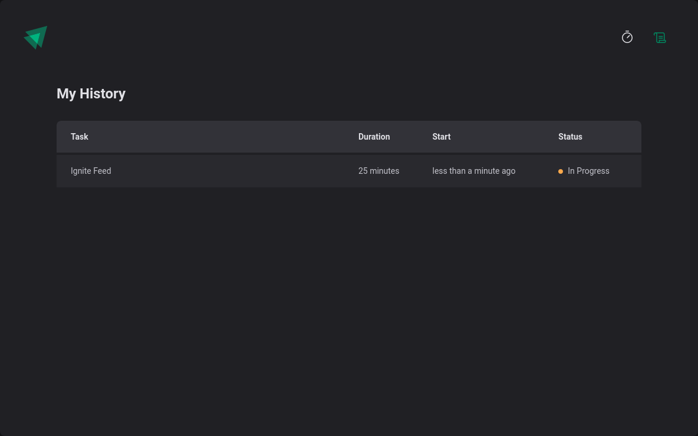

# Pomodoro Timer

## Overview

### App
Check it out now and test the app: [Pomodoro Timer]().

### Screenshot

### Built with

- React
- TypeScript
- Context API
- Reducers
- Styled Components

### What I learned

This challenge was a good way to learn Context API, Reducers and Styled Components.

## Author

- Linkedin - [Thullyo Damasceno](https://www.linkedin.com/in/thullyo-damasceno-375083231)